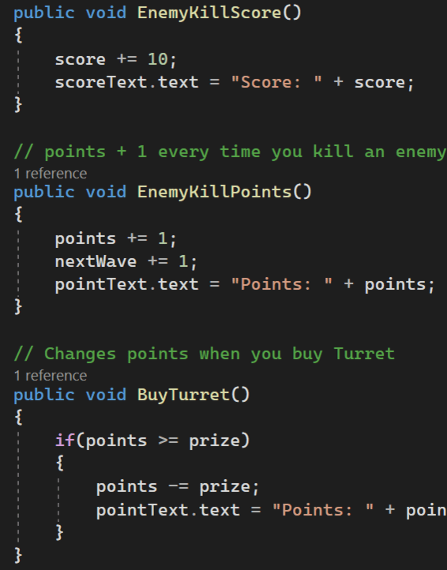
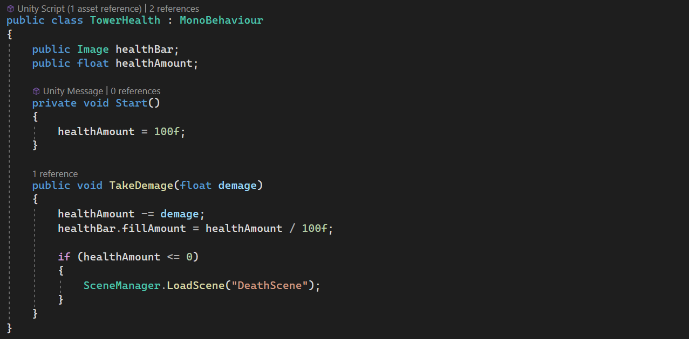
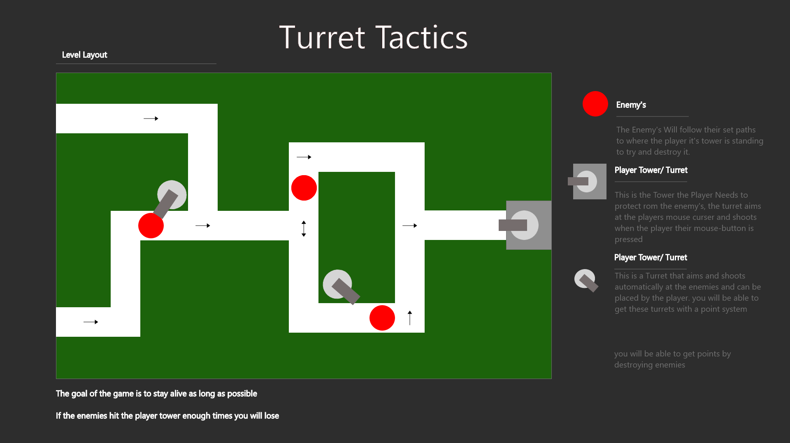

# Turret Tactics Template

**Turret Tactics** is een **Top Down Tower Defence Game**, In turret Tactics moet je zo'n hoog mogelijke **Score** krijgen door te schieten op vijanden, met **Points** kun je turrets kopen die je kan plaatsen op de kleine torens met **Left Click**. Ook heb je een turret die je zelf moet besturen aan de rechter kant van het scherm deze turret moet je aimen met je **Mouse Curser**, je Kan deze turret laten schieten met **Right Click** Als de enemies bij je grote toren komen "Toren Rechts" verlies je **Health** en als al je Health op is heb je verloren.

## Product 1: "DRY SRP Scripts op GitHub"

**Dry:**

Om het Score, Points en Wave Systeem van mijn game bij te houden heb ik een [CounterScript](/TowerDefenceGame/Assets/Scripts/ScoreCount/Counters.cs) aangemaakt. Dit script geeft door aan de canvas text hoeveel Score en Points de speler heeft. Ook geeft dit script informatie aan het script [EnemySpawnRate](/TowerDefenceGame/Assets/Scripts/Enemies/EnemySpawnRate.cs) die de spawn rate van de vijanden aangeeft.

Dit Script heeft drie public functions die worden aangeroepen uit andere scripts, deze scripts gaven voordat ik mijn [CounterScript](/TowerDefenceGame/Assets/Scripts/ScoreCount/Counters.cs) had aangepast geen waardes mee waardoor ik elke keer in de functie moest opschrijven heoveel score, points en waveState er bij kwamen wat ervoor zorgde dat het script erg onoverzichtelijk was.

Dry Script Vergelijking:

    
    

**SingleResponsible:**

Om het Health Systeem aan te geven heb ik een [TowerHealthScript](/TowerDefenceGame/Assets/Scripts/Health/TowerHealth.cs) gemaakt, dit script managed alleen het Health Systeem. dit script gebruikt geen andere scripts maar moet soms wel worden opgeroepen uit andere scripts. wel gebruikt dit script een "Game Object/ Image" maar het oproepen van enkele unity objecten is niet aan te ontkomen.

SingleResponsible Script:

## Product 2: "Projectmappen op GitHub"

Om te bewijzen dat ik een goede mappen structuur heb hier is de ROOT van mijn unity project.

Dit is de [ROOT](/TowerDefenceGame/) folder van mijn unity project.

## Product 3: Build op Github

de game Turret Tactics heeft **meerdere releases**, de meeste releases bestaan uit **kleine bug fixes** of **Dry Code** die niet een heel groot verschil aangeven van gameplay.

[Release Voorbeeld](https://github.com/Zmiles27/TowerDefenseTemplate/releases)

## Product 4: Game met Sprites(animations) en Textures 
Mijn vijanden zijn rollende bowling ballen die een animatie hebben gekregen zodat de game er iets interesanter uit ziet.

## Product 5: Issues met debug screenshots op GitHub 

Ik was mijn scoreSystem aan het anpassen maar kon er niet achter komen waarom de score op het scherm niet omhoog ging. Daarom gebruikte ik breakpoints om de veriables te chekken. Hierdoor kwam ik er achter dat ik per ongeluk pointText had opgeschreven en niet scoreText

## Product 6: Game design met onderbouwing  

One Page Design:

**Je game bevat torens die kunnen mikken en schieten op een bewegend doel.** 

*Mijn Torens hebben eerst niet de mogelijkheid om the schieten omdat er geen turret op staat maar als je genoeg punten hebt schiet de toren op de enemies als de enemies dichtbij genoeg staan* 

**Je game bevat vernietigbare vijanden die 1 of meerderen paden kunnen volgen.**  

*Mijn vijanden kunnen worden neergeschoten door de bestuurbaren turret of door de automatische turrets, Ook volgen deze vijanden 4 verschilende paden waardoor het moeilijk is te voorspellen waar je moet schieten*

**Je game bevat een “wave” systeem waarmee er onder bepaalde voorwaarden (tijd/vijanden op) nieuwe waves met vijanden het veld in komen.**

*elke keer dat je vijf vijanden neer schiet "Spawnen" de vijanden sneller waardoor de game steeds moeilijker wordt*

**Een “health” systeem waarmee je levens kunt verliezen als vijanden hun doel bereiken en zodoende het spel kunt verliezen.** 

*De "Main Tower" heeft een "Health Bar System" die aangeeft hoeveel "Health" je nog hebt als deze "Health Bar" op is ben je af en moet je opnieuw beginnen*

**Een “resource” systeem waarmee je resources kunt verdienen waarmee je torens kunt kopen en .evt upgraden.**

*Als je een vijand neer schiet krijg je punten om torens mee te kunnen kopen*

## Product 7: Class Diagram voor volledige codebase 
het werken aan een **class diagram** was erg overzichtelijk en gaf mij ook goed aan waar ik code kon verbeteren.

    plaats foto Class Diagram hier

## Product 8: Prototype test video
Aan het begin van het project had ik gebrainstormd over een idee voor mijn video game. Mij idee was om de speler zelf ook mee te laten schieten om het spel iets interesanter te maken. vandaar dat ik een handmatigge turret heb gedesigned. het kunnen plaatsen van automatische turrets was ook een idee die ik had vanaf het begin later had ik nog besloten om ervoor te zorgen de de speler uiteindlijk niet meer turrets kon plaatsen om de gameplay iets moeilijker te maken.

    plaats Gameplay Video Hier
## Product 9: SCRUM planning inschatting  

In het designing van de game was het moeilijk dingen te plannen maar heb ik erg mijn best gedaan om alles op schema te houden, mijn sprint was helaas op de laatste dag van de asignment dus ik kon niet veel daarna nog verbeteren.

[Trello Page](https://trello.com/b/k3VdUmHA/tower-defence-game)

## Product 10: Gitflow conventions

Ik ben een beetje laat begonnen aan de Gitflow van dit prject omdat ik helaas ziek was op de dag waar er les over werd gegeven maar heb het weer kunnen inhalen, ik heb veel branches gebruikt aan het eind van het project.

